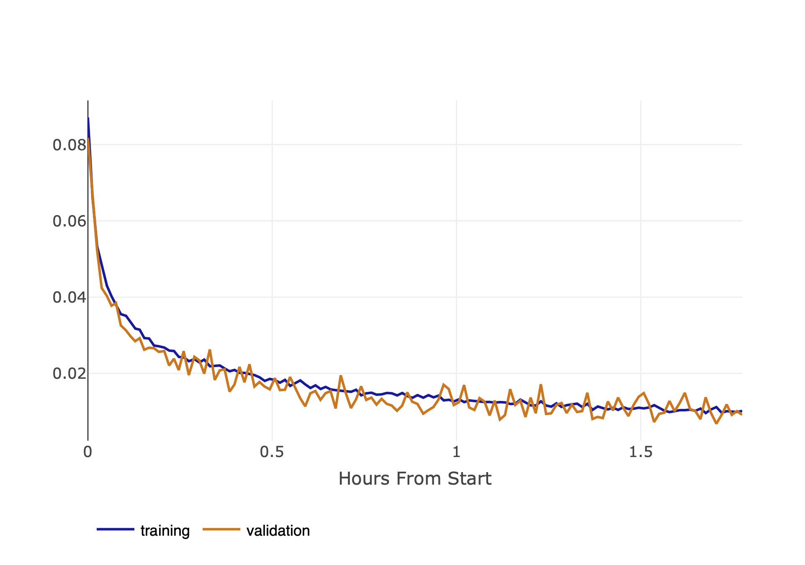

CV-model of Mushroom Recognition with MobileNet

**Introduction:**
This project aims to build a mushroom recognition system using deep learning techniques, specifically leveraging the MobileNet architecture. The recognition system is trained on a dataset consisting of images of various mushroom species. The project employs transfer learning by fine-tuning the pre-trained MobileNet model to recognize mushroom species from images.

**Project Structure:**

- `only_model/only_model.ipynb`: This Jupyter Notebook contains the code for training the mushroom recognition model. It includes importing necessary libraries, data preprocessing, model definition, training loop, evaluation, and saving the trained model checkpoints.
- `model_with_clearml`: This code contains a model that includes tracking of key metrics in ClearML
- `README.md`: This file provides instructions on how to set up the project, install dependencies, and train the model. It also includes information about the dataset and model architecture.

**Requirements:**

- Python 3.x
- PyTorch
- torchvision
- scikit-learn
- NumPy
- Matplotlib
- tqdm

**Dataset:**
The dataset used in this project consists of images of various mushroom species. The dataset is organized into folders, with each folder representing a different mushroom class. During training, the dataset is split into training and validation sets. The ImageFolder class from torchvision is used to load and preprocess the dataset.

**Model Architecture:**
The model architecture used for mushroom recognition is MobileNetV3 Large, pre-trained on the ImageNet dataset. Transfer learning is employed by fine-tuning the pre-trained MobileNet model on the mushroom dataset. The model's classifier layers are modified to output predictions for the specific mushroom classes present in the dataset.

**Training:**
The training process involves several steps:

1. Data preprocessing: Images are resized, augmented, and normalized before feeding into the model.
2. Model definition: The MobileNetV3 Large model is loaded with pre-trained weights and modified for fine-tuning on the mushroom dataset.
3. Loss function and optimizer: Cross-entropy loss is used as the loss function, and Adam optimizer with weight decay is used for optimization.
4. Training loop: The model is trained over multiple epochs, with each epoch consisting of training and validation phases. Training and validation losses are monitored to assess model performance.
5. Model evaluation: The model's performance is evaluated on the validation set using metrics like accuracy and loss.
6. Saving checkpoints: Checkpoints of the model are saved periodically based on validation performance.

**Results:**
The trained model achieves competitive performance in recognizing mushroom species from images. Evaluation metrics such as accuracy and loss are monitored during training to track the model's progress.

**Model Training Metrics**

Below are the key training metrics tracked during the training of the mushroom recognition model using ClearML.

**Loss Curves:**
   By time:  

- 
    By epoch:  

- 

**Accuracy Curves:**

- 

**Learning Rate Schedule:**

- 

**Conclusion:**

The training metrics tracked using ClearML provide insights into the model's training progress, performance, and convergence behavior. Monitoring these metrics helps in understanding the model's behavior and making informed decisions regarding model optimization and hyperparameter tuning.

**Note:** Replace "insert_image_url_here" and "insert_checkpoint_url_for_epoch_X_here" placeholders with the actual URLs of your images and checkpoints.
**Instructions for Use:**

1. Clone the repository: `git clone https://github.com/sevdaisk/Mushroom-recognition.git`
2. Navigate to the project directory: `cd Mushroom-recognition`
3. Install dependencies
4. Execute the `only_model.ipynb` notebook to train the model.
5. Optionally, fine-tune hyperparameters and experiment with different augmentation techniques for improved performance.

**References:**

- MobileNetV3 Paper: [MobileNetV3 Paper](https://arxiv.org/abs/1905.02244)

**Contributors:**

- ardipazij

**Acknowledgments:**
I acknowledge the contributions of the creators of PyTorch, torchvision, and other open-source libraries used in this project. I also thank the authors of the MobileNetV3 paper for their valuable research.
